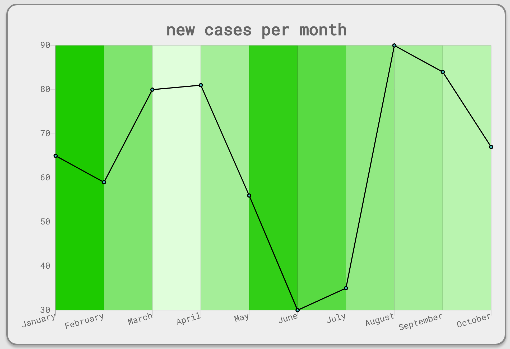

# DAVID19
### Dat's A Very Interesting Datapoint 1(I) 9(G)uess 
Jennifer Kim, Samuel Lee, Derek Yen @**HackMIT 2020**  

## Overview

COVID19 is a highly complex issue. While the most salient number people pay attention to is still the number of new cases or deaths, these don't tell the whole story. One needs to understand unemployment rates, business closings and school reopenings among innumerable other statistics in order to get the whole story. However, even beyond the hard numbers, we need to understand how the public perceives the pandemic.  

How is your community, both locally and at large, responding to COVID19? Are people optimistic about local businesses coming back? What can we do to alleviate the disproportionately devastating effects of the pandemic on less privileged people groups? These questions require community responses along with the hard numbers in order to get the whole story.  

Our goal with this project is to provide that story. By using IBM Watson's NLU and Discovery services, we can gather the latest updates on both the hard numbers and how people are responding to those numbers. In an intuitive, easy-to-digest format, our users can see information at a glance that gives them a more complete picture of their communities, allowing for a level of connectivity we have been sorely missing lately and better informing decisions pertaining to everything from planning grocery runs to planning school reopenings.

*Wireframe only using dummy data and large time span to show proof of concept.  

## Implementation Details
- [x] Wireframe with React and set up working individual components of full stack
- [x] Implement Reddit scraper to grab top posts from r/COVID19
- [ ] Utilize other APIs for other sites, such as Twitter and NYT
- [ ] Incorporate IBM Watson Discovery to gather COVID statistics
- [x] Use IBM Cloudant to store web scrapings and NLU analysis outputs
- [x] Proof of concept of using IBM Watson NLU
- [ ] Create pipeline of scrapings + data -> NLU processing -> Display on graph
- [ ] Multiple graphs for individual issues, more fine-tuned user control how data is displayed
- [ ] Anonymous and account-based surveys as additional datapoint from our users
- [ ] IBM Watson Assistant embedding

## Demo Instructions
- `npm i` in the /frontend and /backend subdirectories to install necessary packages
- `npm start` in the /backend subdirectory to see output of Watson on dummy sentence in terminal/console (modify sentence for different results)
- `npm start` in the /frontend subdirectory to start up React page displaying the above wireframe and the result of previous step
